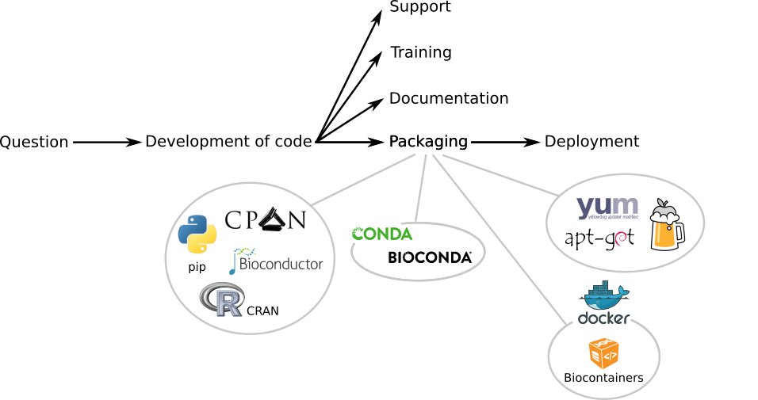
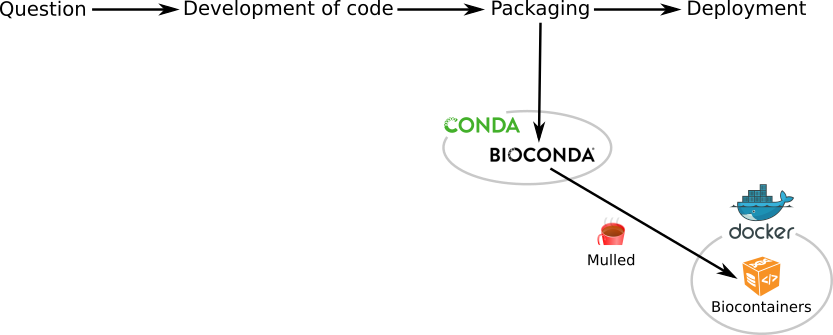
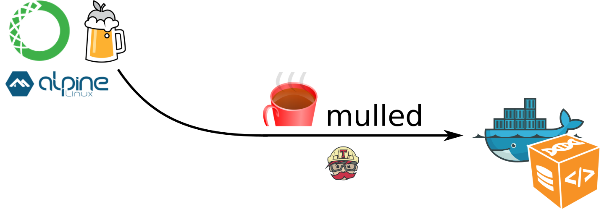
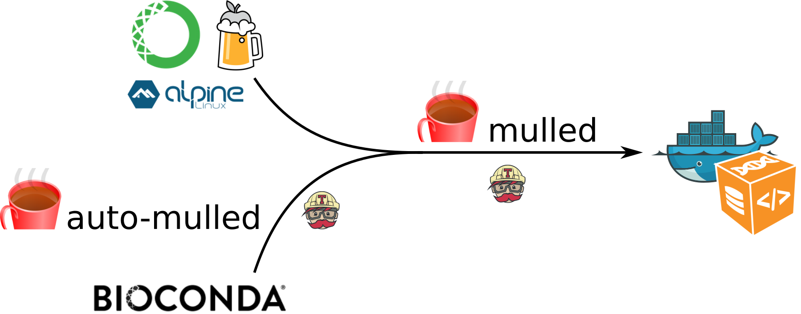
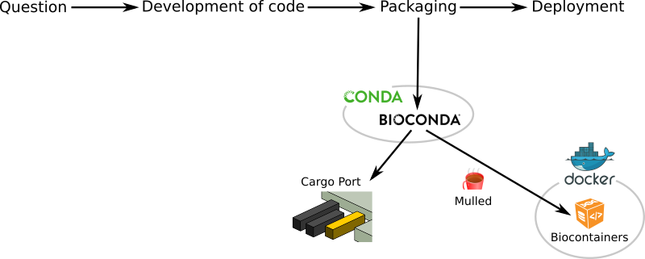
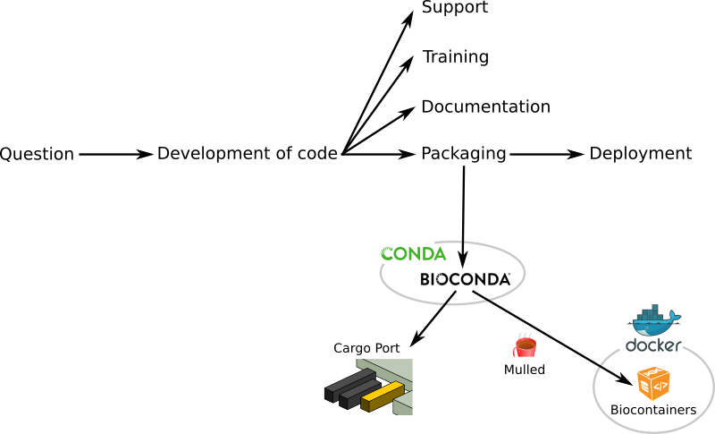

### Tool deployment and sustainability <br>in bioinformatics <br><i class="fa fa-check"></i> Fixed<br><br>

**Bérénice Batut**, Jonas Weber, Rolf Backofen, Björn Grüning

<small>
University of Freiburg<br><br>Bioinformatics for Human Health and Disease<br>Heidelberg - November 2016
</small> 

Note: Hello, My name is Bérénice. I am from the University of Freiburg. First, I would like to thank the organisers to let me present this work today. 
I will talk to you about deployment and sustainability of bioinformatics tools, their issues and solutions.

---

### Biomedical research

Generation of massive amounts of diverse data

<i class="fa fa-long-arrow-right"></i> Need of bioinformatic solutions and tools

Note: Nowadays, for biomedical research, massive amounts of data are generated to answer the questions. This data are diversed: genomic data, images, ... as well as the questions. To manipulate these data and extract useful information to answer the questions, bioinformatics solutions and tools are needed. Some tools already exist for your question. But sometimes, you need a new tool specific for your question.

----

### How to develop a tool?


Note: Development of some source code that can be distributed as it is. Easy when the tool is simple and simple to deploy (not tool much dependencies)

----

### How to develop a tool?


Note: To help its deployment and ease the usage of the tools, the code is packaged in various package formats (langage specific, OS specific, independent of the OS, ...)
The tool behind the code can be then easily deployed and used by the targeted users.
 
----

### How to develop a tool?<br>The Golden Path



Note: To help users , spread the solution and advertise it, documentation, training and support are also provided. The Golden Path of tool development
this Golden Path works well when your tool is simple and do not rely on many dependencies. 

----

### But...

Who has never dealed with missing tool dependencies?<br>
Or an older version of a tool that could not be installed?

### <i class="fa fa-exclamation-triangle"></i> Major issues in <br>deployment and sustainability

Note: missing tool dependencies because the dependencies is not available anymore (not maintained, server out, ...). We have here an issue of sustanability of tools
An older version that could not be installed in your OS, or your version of your OS, .... We have here an issue of deployment.
These two issues: a major issue for productivity and reproducibility in science
 
---

## Deployment issue

Note: issue related to tool not installable/deployable. If you want your tool to be used, your tool must be easily deployed anywhere

----

### <i class="fa fa-bullseye"></i> Wanted

A package manager
- Programming language agnostic
- OS independent
- No root privileges needed
- Management of multiple version
- HPC and Cloud compatible
    
Note: 
- Programming language agnostic: Development of bioinformatic tools in mostly all available languages
- OS independent: Tools used on every major operating systems
- No root privileges needed: some of the users do not have the root privilege on their computer thanks to their sys admin
- Management of multiple version: your tool may need a tool with a given version but an other tool an older version.

----

### A great solution<br>

- Open Source package manager
- Independent of any programming language and OS
- Fast, robust and easy package installation

  ```
  $ conda install deeptools
  ```
  
- Installation and management of multiple versions

Note: 
- Independent of any programming language and OS: if developed first for python tools
- Less than 1 minute to install deeptools with conda

----

### A Conda package


<i class="fa fa-long-arrow-right"></i> Easy to write!

Note: Only 2 files + Extensive documentation

----

### Bioinformatics tools<br>


- More than 1,700 bioinformatic packages
- Big, fast-growing and newcomer-friendly community

Note: 
- Bioconda: a distribution of bioinformatics softwares using Conda
- Started a year ago
- Big (how much?)
If you have a tool, we recommend you to develop a bioconda package for this

----

### Want to have a Docker image?<br>
 


Note: If you have your bioconda package, you may want Docker image, an higher layer of abstraction and isolation of the base system. Mulled will generate it for you from your bioconda package

----

### Mulled

A layer donning approach to build Docker containers<br>(without Dockerfile)



Note: From conda, brew or alpine package, you can ask to mulled to build a container for you

----

### Mulled



Note: Better if you have a bioconda package, you have nothing to do. Mulled scans all bioconda packages daily and build biocontainer for you, for nothing

----

### Deployment issue <i class="fa fa-long-arrow-right"></i> <i class="fa fa-check"></i>Fixed!


Note: If you package your tool with bioconda, you and your users can deploy as it, or as a docker image and even rocket or singularity container easily. You have nothing to do, only a bioconda package

---

## Sustainability issue

Note: You have your package. But it relies on dependencies that are not anymore accessible. You have a sustainability issue

----

### <i class="fa fa-bullseye"></i> Wanted

- Accessibility of all packages
- Cache of all versions of the packages
- Permanent access

Note: Permanent cache of all available packages to be always reachable and enable reproducibility

----

### A solution<br>Cargo Port

- [A public repository](https://depot.galaxyproject.org/software/), kindly hosted by the Galaxy Project
- Stable and long term storage
- Daily archives of the BioConda packages

Note: It archives many package with a stable and long term storage.

----

### Sustainability issue <i class="fa fa-long-arrow-right"></i> <i class="fa fa-check"></i>Fixed!


Note: With the automatic backup of bioconda packages in Cargo Port, the sustainability issue of your package is fixed

---

### Tool deployment and sustainability <br>in bioinformatics<br> <i class="fa fa-long-arrow-right"></i> <i class="fa fa-check"></i>Fixed!



Note: 
Development of BioConda packages is really easy and eases the packaging and the deployment of any bioinformatic tool. With Mulled project, efficient Linux containers are automatically built from your conda package to ensure an even higher layer of abstraction and isolation of the base system. This is a great community effort to create a flexible, scalable sustainable system to fix the tool deployment problem once and for all

The interface of bioconda packages with Cargo Port enables sustainability by mirroring all sources. 

 I hope that I convince you that Thanks to these collaborative projects, their community and their collaborations, bioinformatics tools can be easily packaged, deployed and will be always available to help biomedical research. 

---

### Thank You!<br>Questions?


